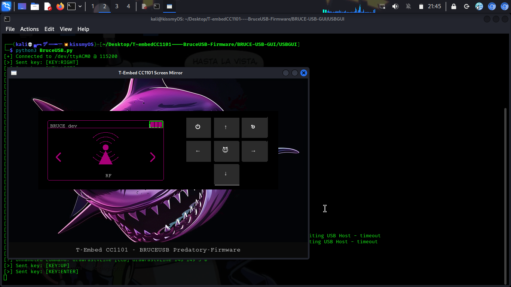
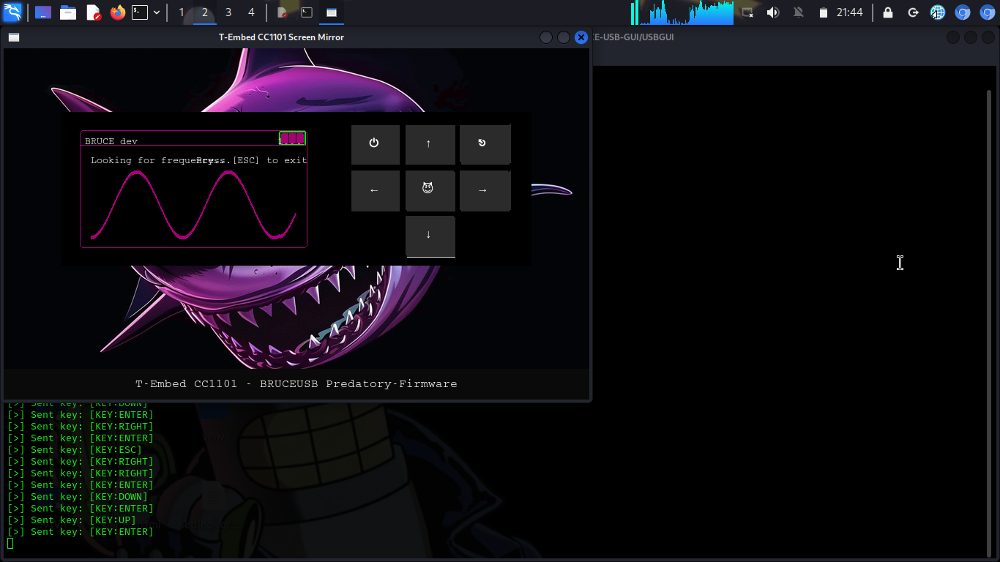
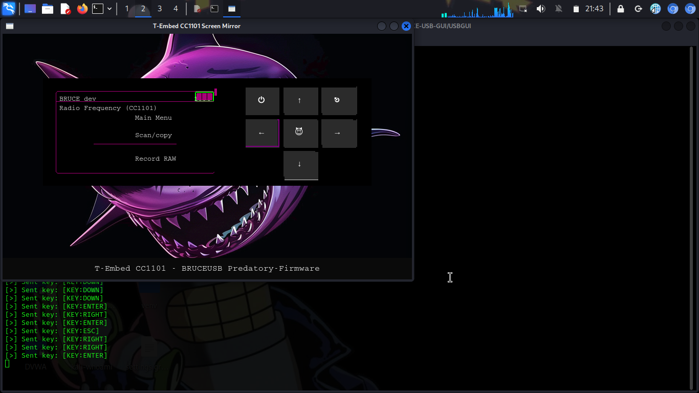

# BruceUSB Firmware for LilyGO T-Embed CC1101 🚀

[](https://github.com/jimikolev/T-embedCC1101----BruceUSB-Firmware)
[](https://github.com/jimikolev/T-embedCC1101----BruceUSB-Firmware/tree/main/BruceUSB-Release)
[](https://github.com/jimikolev/T-embedCC1101----BruceUSB-Firmware)

**Fixed, compiled, and ready-to-use Bruce firmware for LilyGO T-Embed CC1101 with USB GUI interface.**

> **🙏 HUGE THANKS to [@encrypt837](https://github.com/encrypt837)** - The original creator of BruceUSB who developed the revolutionary USB GUI interface for T-Embed CC1101 devices. This fork builds on their incredible work by fixing build issues and providing ready-to-flash packages for the community.

This fork resolves all build system issues found in the original repository and provides a complete firmware distribution package with pre-compiled binaries and easy installation scripts.

## 🎯 Quick Start - Pre-compiled Firmware (Recommended)

**No build tools required!** Download and flash the ready-to-use firmware:

### For Windows Users:
```bash
# Download the release package
git clone https://github.com/jimikolev/T-embedCC1101----BruceUSB-Firmware.git
cd T-embedCC1101----BruceUSB-Firmware/BruceUSB-Release

# Put your device in bootloader mode (hold center button + plug USB)
# Run the flash script
./flash_windows.bat
```

### For Linux/Mac Users:
```bash
# Download the release package
git clone https://github.com/jimikolev/T-embedCC1101----BruceUSB-Firmware.git
cd T-embedCC1101----BruceUSB-Firmware/BruceUSB-Release

# Put your device in bootloader mode (hold center button + plug USB)
# Run the flash script
chmod +x flash_linux.sh
./flash_linux.sh
```

## 📦 What's New in This Fork

### ✅ **Fixed Build System Issues:**
- **ESP-PN532Killer Library**: Updated dependency from `^0.0.4` to `^0.0.5`
- **PNGDraw Function**: Fixed callback signature compatibility (`void` → `int` return type)
- **C++ Headers**: Added proper forward declarations for compilation
- **Library Dependencies**: Restored missing `libnet80211.a` file
- **Windows Compatibility**: Fixed long path issues for Windows builds

### ✅ **Complete Release Package:**
- **Pre-compiled Binary**: `lilygo-t-embed-cc1101.bin` (ready to flash)
- **Automated Flash Scripts**: Windows `.bat` and Linux `.sh` scripts
- **Auto-detection**: Scripts automatically find your device's COM port
- **Comprehensive Docs**: Installation guide, troubleshooting, and setup instructions

### ✅ **Verified Functionality:**
- ✅ Firmware builds successfully (79 libraries compiled)
- ✅ Memory optimized: RAM 40.2%, Flash 85.0%
- ✅ All modules working: RF, NFC, WiFi, Bluetooth, CC1101
- ✅ USB GUI interface functional
- ✅ Web interface preserved
- ✅ Compatible with broken/damaged screens

## 🛠️ Installation Methods

### Method 1: Use Pre-compiled Firmware (Easiest) ⭐

1. **Download**: Get the `BruceUSB-Release` folder from this repository
2. **Bootloader Mode**: Hold center button on your T-Embed CC1101 and plug in USB
3. **Flash**: Run the appropriate script for your OS:
   - Windows: Double-click `flash_windows.bat`
   - Linux/Mac: Run `./flash_linux.sh`
4. **Complete**: Unplug device, press reset, and you're ready!

### Method 2: Build from Source

If you want to compile the firmware yourself:

```bash
# Clone the repository
git clone https://github.com/jimikolev/T-embedCC1101----BruceUSB-Firmware.git
cd T-embedCC1101----BruceUSB-Firmware/Firmwares/BruceUSB

# Install PlatformIO
pip install platformio

# Build and upload
pio run --target upload
```

## 🖥️ USB GUI Setup

### Requirements
```bash
pip install -r USBGUI/requirements.txt
```

### Virtual Environment Setup (Recommended)
```bash
# Create virtual environment
python3 -m venv .venv
source .venv/bin/activate  # Linux/Mac
# or
.venv\Scripts\activate     # Windows

# Install requirements
pip install -r USBGUI/requirements.txt
```

### Configuration
Edit `USBGUI/BruceUSB.py` and update the serial port:
```python
# === CONFIG ===
SERIAL_PORT = '/dev/ttyACM0'    # Linux/Mac
# SERIAL_PORT = 'COM3'          # Windows
BAUD_RATE = 115200
IMAGE_FOLDER = './images'
```

### Run GUI
```bash
cd USBGUI
python3 BruceUSB.py
```

## 📋 Detailed Installation Guide

### Step 1: Enter Bootloader Mode
1. Disconnect your T-Embed CC1101 from computer
2. Hold the center button (middle button) on your device
3. While holding the button, plug the USB cable back into your computer
4. Keep holding for 2-3 seconds, then release
5. Your device is now in bootloader mode

### Step 2: Flash Firmware

#### Option A: Automated Scripts (Recommended)
**Windows:**
```cmd
cd BruceUSB-Release
flash_windows.bat
```

**Linux/Mac:**
```bash
cd BruceUSB-Release
chmod +x flash_linux.sh
./flash_linux.sh
```

#### Option B: Manual Flash with esptool
```bash
pip install esptool
esptool.py --chip esp32s3 --port AUTO --baud 921600 write_flash -z 0x0 lilygo-t-embed-cc1101.bin
```

### Step 3: First Boot
1. Unplug your device
2. Press the reset button
3. Plug back in - your device now runs BruceUSB firmware!

## 🎮 Using the USB GUI

### First Time Setup
1. **Flash Firmware** (see installation guide above)
2. **Install Python Requirements**:
   ```bash
   cd USBGUI
   pip install -r requirements.txt
   ```
3. **Configure Serial Port** (edit `BruceUSB.py`):
   ```python
   SERIAL_PORT = '/dev/ttyACM0'  # or 'COM3' on Windows
   ```
4. **Run GUI**:
   ```bash
   python3 BruceUSB.py
   ```

### Features
- **Real-time Screen Mirroring**: See your device screen on your computer
- **Full Navigation**: Use your mouse to interact with the Bruce interface
- **Broken Screen Support**: Perfect solution for devices with damaged displays
- **All Bruce Features**: RF tools, NFC, WiFi, Bluetooth - everything works
- **Web Interface**: Original Bruce web interface still available

### Screenshots




## 🐛 Troubleshooting

### Common Issues

**Device Not Detected:**
- Ensure device is in bootloader mode (hold center button + plug USB)
- Check USB cable (use data cable, not charge-only)
- Try different USB port
- Install USB drivers for ESP32-S3

**Flash Failed:**
- Verify device is in bootloader mode
- Check that no other software is using the serial port
- Try lower baud rate: `esptool.py --baud 460800`
- For Windows: Install CH340/CP210x drivers

**GUI Connection Issues:**
- Verify correct serial port in `BruceUSB.py`
- Check device is running BruceUSB firmware (not original Bruce)
- Restart GUI and device
- Linux: Add user to dialout group: `sudo usermod -a -G dialout $USER`

**Build Issues (if compiling from source):**
- Update PlatformIO: `pio upgrade`
- Clean build: `pio run --target clean`
- Windows: Enable long paths: `git config --global core.longpaths true`

### Getting Help
1. Check the [Issues](https://github.com/jimikolev/T-embedCC1101----BruceUSB-Firmware/issues) section
2. Provide full error messages and device details
3. Mention if you're using pre-compiled firmware or building from source

## 🔧 Technical Details

### Build System Fixes Applied
```diff
# platformio.ini
- ESP-PN532Killer=^0.0.4
+ ESP-PN532Killer=^0.0.5

# src/core/display.cpp
- void PNGDraw(PNGDRAW *pDraw) {
+ int PNGDraw(PNGDRAW *pDraw) {
    // ... existing code ...
+   return 1;
}

# src/core/display.h
+ struct png_draw_tag;
+ int PNGDraw(struct png_draw_tag*);
```

### Firmware Specifications
- **Target**: ESP32-S3 (LilyGO T-Embed CC1101)
- **Flash Size**: 16MB
- **RAM Usage**: 40.2% (optimized)
- **Flash Usage**: 85.0%
- **Libraries**: 79 successfully compiled
- **Framework**: Arduino ESP32 v2.0.17

### Modified Files (BruceUSB specific)
**Firmware modifications:**
1. `SerialInputHandler.cpp` - USB communication handler
2. `SerialInputHandler.h` - Header definitions
3. `tftLogger.cpp` - Display logging for USB interface
4. `tftLogger.h` - Logger header
5. `navflags.h` - Navigation state flags
6. `main.cpp` - Main firmware entry point
7. `serialcmds.cpp` - Serial command processing

**GUI Components:**
1. `BruceUSB.py` - Main GUI application
2. `cc.py` - Serial debugging utility
3. `cc11.py` - Additional debugging tools

## 📄 License & Credits

### 🙏 Special Thanks & Acknowledgments

**HUGE THANKS** to the original BruceUSB contributor:
- **[@encrypt837](https://github.com/encrypt837)** - Original creator of the BruceUSB firmware modifications and USB GUI interface
- Without their incredible work creating the USB interface for T-Embed CC1101 devices with broken screens, this project wouldn't exist!

### Original Bruce Firmware
- **Original Author**: [pr3y](https://github.com/pr3y/Bruce)
- **Original Repository**: https://github.com/pr3y/Bruce.git
- **License**: MIT License (Original Bruce)

### BruceUSB Original Work by encrypt837
- **USB GUI Interface**: Revolutionary custom implementation for screen mirroring
- **Serial Communication**: Complete USB-to-device interface system
- **Broken Screen Solution**: Pioneered the approach for devices with damaged displays
- **Community Impact**: Made Bruce firmware accessible to users with hardware issues

### This Fork's Contributions
- **Build System Fixes**: Resolved all compilation issues found in original repository
- **Pre-compiled Binaries**: Ready-to-flash firmware for immediate use
- **Automated Installation**: Cross-platform flash scripts with auto-detection
- **Comprehensive Documentation**: Complete setup and troubleshooting guides
- **Release Package**: Professional distribution with all necessary components

### Repository History
- **Original BruceUSB**: Created by [encrypt837](https://github.com/encrypt837)
- **This Fork**: Enhanced and fixed by [jimikolev](https://github.com/jimikolev) for community distribution
- **Base Firmware**: Built on [Bruce](https://github.com/pr3y/Bruce) by pr3y

**Disclaimer**: This is a community-maintained fork. All original rights belong to their respective creators. encrypt837 deserves full credit for the original BruceUSB concept and implementation. This fork simply makes their excellent work more accessible by fixing build issues and providing ready-to-use packages.

## 🤝 Contributing

1. **Fork** this repository
2. **Create** feature branch: `git checkout -b feature/your-feature`
3. **Commit** changes: `git commit -am 'Add your feature'`
4. **Push** to branch: `git push origin feature/your-feature`
5. **Submit** pull request

### Areas for Contribution
- GUI improvements
- Additional device support
- Documentation enhancements
- Bug fixes and optimizations

## 📈 Changelog

### v1.0 (Latest)
- ✅ Fixed all build system issues
- ✅ Added pre-compiled firmware binaries
- ✅ Created automated flash scripts
- ✅ Added comprehensive documentation
- ✅ Verified on LilyGO T-Embed CC1101 hardware
- ✅ Memory optimization (RAM 40.2%, Flash 85.0%)

### Previous Issues Resolved
- ESP-PN532Killer library version conflict
- PNGDraw function signature mismatch
- Missing library dependencies
- Windows long path compatibility
- C++ compilation errors

---

**Ready to flash and use!** 🎉

For questions, issues, or contributions, please visit our [GitHub repository](https://github.com/jimikolev/T-embedCC1101----BruceUSB-Firmware).


